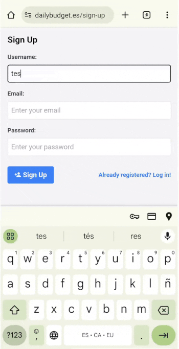

# Daily Budget App

The Daily Budget App is a simple full-stack web application built using Express.js and EJS for managing daily expenses. It allows users to track their expenses, view historical data, and calculate their remaining budget based on daily expenses. This application is designed to work seamlessly on both desktop and mobile platforms.

You can use the application at 🔗 *[dailybudget.es](dailybudget.es)*

## Key Features

- **User Authentication:** Supports user registration and login using local strategies
- **Expense Tracking:** Users can add and remove expenses, set budgets, and view their expense history.
- **Budget Calculation:** The app calculates ongoing expenses and remaining budget per day, providing users with insights into their spending patterns.
- **Responsive Design:** Optimized for both mobile and desktop usage.

## Technologies Used

- **Backend:** Node.js with Express.js
- **Frontend:** EJS for templating, Tailwind CSS for styling
- **Database:** MongoDB with Mongoose for data management
- **Authentication:** Passport.js for handling user authentication
- **Session Management:** Express-session with MongoDB storage
- **Deployment:** Railway for application hosting
- **DNS:** Cloudflare for DNS management

## Challenges Encountered

### Deployment Challenges

- **Domain Purchase and Configuration:** Bought a custom domain and learned about DNS management using Cloudflare to host the application's DNS records.
- **Railway Deployment:** Deployed the application on Railway, configuring environment variables and managing deployments, ensuring the custom domain is correctly integrated.
- **DNS Propagation:** Faced issues with DNS propagation which took longer than expected, requiring troubleshooting of DNS settings and understanding CNAME records and Cloudflare's proxy settings.

### Learning Experiences

- **Full-Stack Development:** This being the first full-stack project, provided a comprehensive learning experience from frontend to backend integration, dealing with databases, and user authentication.
- **Responsive Design:** Ensured the application was responsive and functional on both desktop and mobile devices.
- **Security Practices:** Implemented secure handling of user authentication and session management using best practices.

## Future Enhancements

- **Advanced Budget Features:** Implement more complex budget management features like future projections and savings goals.
- **API Expansion:** Develop an API for third-party integrations.
